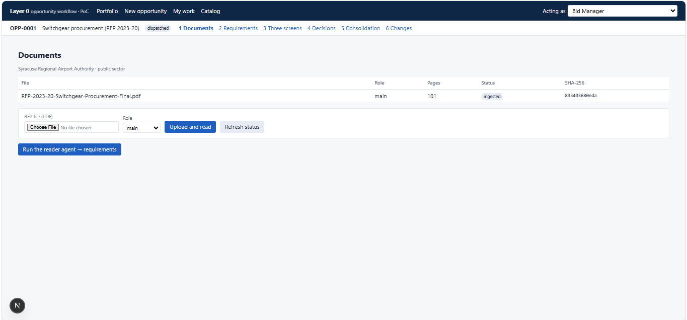
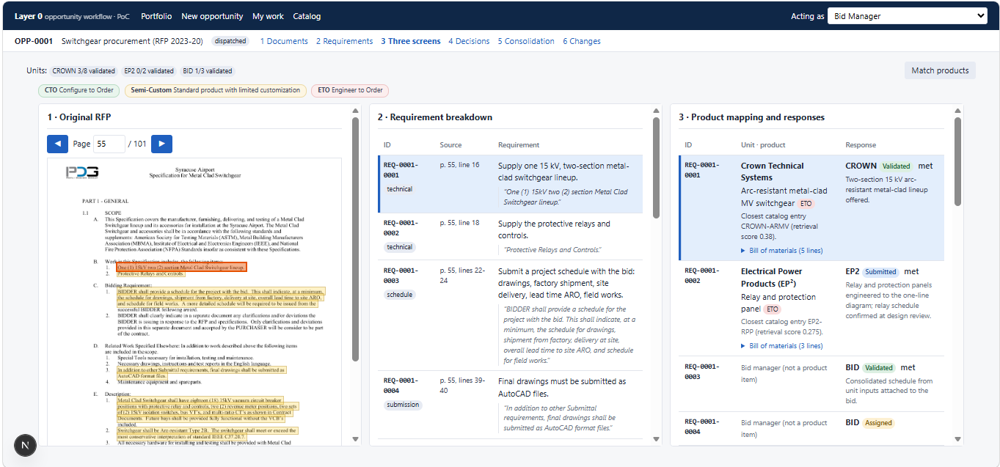
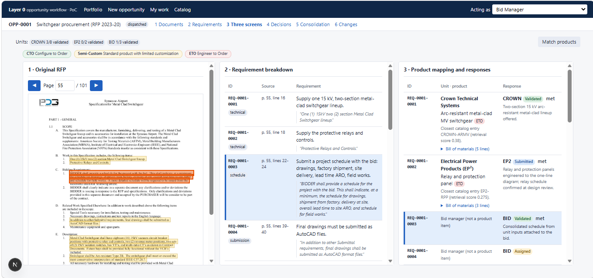
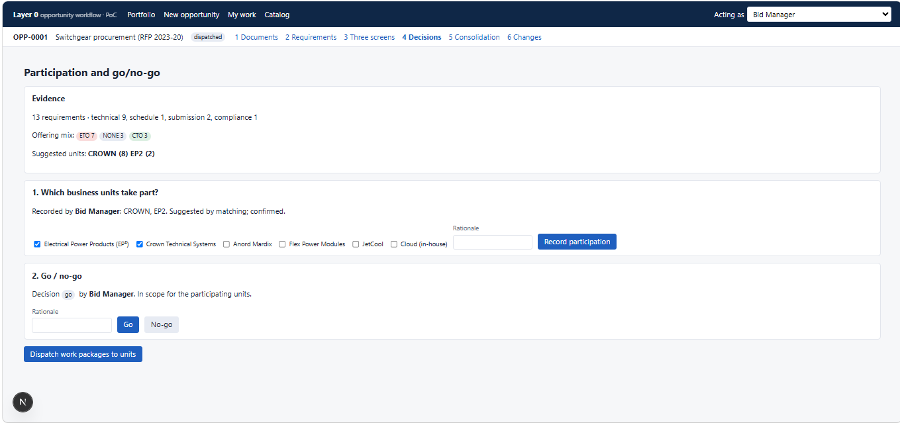
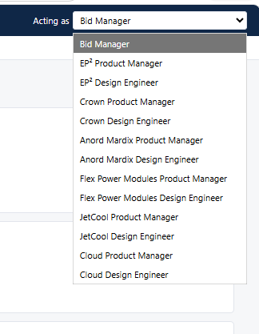
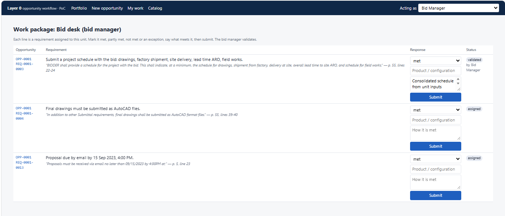
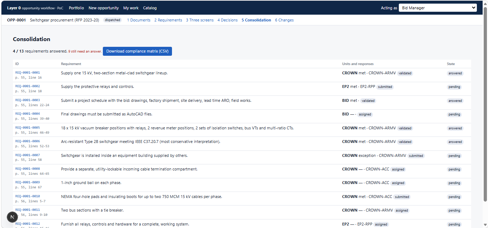
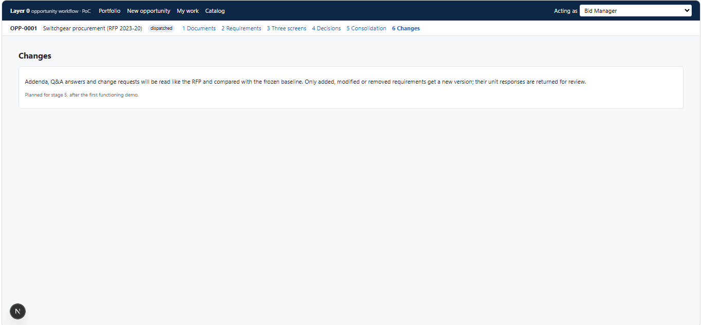
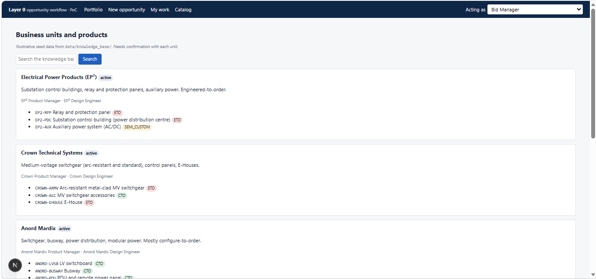

# Layer 0 Walkthrough

## 1. Overview

Layer 0 helps manage a bid opportunity from the customer's request for proposal (RFP) to a consolidated response. It reads the RFP into numbered requirements with exact sources, proposes a business unit and product for each, records participation and go/no-go decisions, and collects and consolidates each unit's response. Every response stays traceable to its requirement and to the RFP page it came from.

This walkthrough follows one example bid through the screens in the order of the work. Layer 0 is a proof of concept: the screens show demonstration data, and functionality that is not yet available is labelled **Planned**.

## 2. Demonstration Scenario

The example is **OPP-0001, Switchgear procurement (RFP 2023-20)** for **Syracuse Regional Airport Authority** (public sector). The RFP is a 101-page PDF, and 13 requirements have been extracted from it. The opportunity has the status "dispatched". Three parties respond in the example: the business units **CROWN** and **EP2**, and the **BID** desk (the bid manager's own requirements).

## 3. End-to-End Workflow

The screens follow this order of work. The Screen column gives the page, or the numbered step in the bar below the page header.

| Step | What happens | Screen | Status |
|---|---|---|---|
| 1 | **Opportunity creation:** a title, customer and customer type are entered. | New opportunity | Current |
| 2 | **RFP document upload:** the RFP PDF is added to the opportunity. | 1 Documents | Current |
| 3 | **Requirement extraction:** requirements are extracted from the document. | 1 Documents | Current |
| 4 | **Requirement review:** each requirement is checked against its source, and a baseline is recorded. | 2 Requirements | Current |
| 5 | **Source traceability:** a requirement can be followed to its place on the RFP page. | 3 Three screens | Current |
| 6 | **Product and business-unit matching:** each requirement is proposed to a unit and product. | 3 Three screens | Current |
| 7 | **Participation and go/no-go:** the bid manager records which units take part and whether to bid. | 4 Decisions | Current |
| 8 | **Work-package dispatch:** each participating unit receives its requirements (its work package). | 4 Decisions | Current |
| 9 | **Unit response collection:** units answer, and the bid manager validates the answers. | My work | Current |
| 10 | **Consolidation:** responses are brought together, and open items are shown. | 5 Consolidation | Current |
| 11 | **Change handling:** later changes to the RFP are handled against the baseline. | 6 Changes | **Planned** |

## 4. Opportunities

**Purpose.** The starting page. It lists the opportunities and where each one stands.

*Figure 1. The Opportunities page.*

- Each row shows the opportunity ID, title, customer, status and number of requirements (13 in the example).
- **Unit responses (validated / total)** shows, for each unit and the bid desk, how many responses are validated out of those assigned: CROWN 3/8, EP2 0/2 and BID 1/3.
- **Open** enters the opportunity at the Documents step.

## 5. New Opportunity

**Purpose.** Starts a new bid.

*Figure 2. The New opportunity form.*

The form asks for a **title**, the **customer** and the **customer type**. **Create** adds the opportunity to the list.

## 6. Documents

**Purpose.** Holds the RFP and the other documents of the opportunity.

*Figure 3. The Documents step, showing the RFP with status "ingested".*

- The customer and its sector are shown above the file list.
- Each document shows its **file name**, **role** ("main" for the RFP), **page count** (101) and **status** ("ingested").
- A further PDF can be added by choosing a file and a role and selecting **Upload and read**. **Refresh status** updates the status column.
- The separate action **Run the reader agent → requirements** initiates requirement extraction from the uploaded RFP document.

Once requirements exist, the **2 Requirements** step shows them.

## 7. Requirements Review

**Purpose.** Lets the requirements be checked against the RFP before the work starts.

*Figure 4. Requirement review, with source and exact quotation for each requirement.*

- Each requirement has an **ID** (for example REQ-0001-0001), a **source** (page and lines of the RFP) and a **category**: technical, schedule, submission or compliance.
- The requirement is stated in plain language, with the **exact quotation** from the RFP beneath it.
- Each requirement has a **status**; the requirements shown are "approved".
- A note states that Baseline 1 was frozen by the Bid Manager with 13 items. Later changes are handled as a difference from this baseline.

## 8. Requirement Traceability and Product Matching

This capability is presented through the Three Screens view, which brings together the source document, extracted requirements, and proposed products and responses.

**Purpose.** Shows a requirement, its source and its proposed product and response in one view.

*Figure 5. The Three Screens view with REQ-0001-0001 selected.*

| Panel | Content |
|---|---|
| **1. Original RFP** | The RFP page, with requirement text highlighted. Page controls move through the document. |
| **2. Requirement breakdown** | ID, category, source, requirement and quotation. |
| **3. Product mapping and responses** | The proposed business unit and product, offering type, matching rationale, optional Bill of Materials (BOM), and response status. |

**How it works**
- Selecting a requirement in any panel selects it in all three panels. The RFP opens on the page of the requirement, with its text highlighted more strongly than the others.
- Each panel scrolls on its own.
- The line above the panels shows each unit's validated responses (for example, CROWN 3/8 validated).
- **Match products** proposes a business unit and product for each requirement.
- A requirement that is not a product item is shown as belonging to the **Bid manager**.

*Figure 6. REQ-0001-0003 selected: the same requirement is highlighted in all three panels, and its text is marked on RFP page 55.*

**Traceability.** From one requirement the reader can see its exact RFP wording and location, the product proposed for it and the response it received. The same ID and source then appear in the unit's work package and in Consolidation.

**Offering types.** A legend under the toolbar explains the three types:

| Type | Meaning |
|---|---|
| CTO | Configure to Order |
| Semi-Custom | Standard product with limited customization |
| ETO | Engineer to Order |

## 9. Decisions: Participation and Go/No-Go

**Purpose.** Records the decisions of the bid manager and releases the work.

*Figure 7. The Decisions step.*

1. **Evidence.** The number of requirements by category (13 in total), the offering mix (ETO 7, CTO 3, NONE 3, where NONE means requirements that are not product items) and the suggested units (CROWN 8, EP2 2).
2. **Which business units take part?** The bid manager selects the participating units from the list, may enter a rationale, and selects **Record participation**. The screen shows who recorded the choice.
3. **Go / no-go.** The bid manager selects **Go** or **No-go**, with a rationale field. The screen shows the decision and who made it.

**Dispatch work packages to units** then sends each participating unit its requirements.

## 10. Work Packages and Responses

**Purpose.** Gives each unit, and the bid desk, its own list of requirements to answer.

The demonstration allows selection of different participant roles using the **Acting as** selector. The list contains the Bid Manager and, for each business unit, a Product Manager and a Design Engineer. **My work** opens the work package of the selected role's unit.

*Figure 8. The Acting as selector.*

*Figure 9. The work package of the Bid desk (bid manager).*

- The example shows the work package of the **Bid desk (bid manager)**.
- Each line shows the requirement, its exact quotation and its source.
- The response has a compliance choice (the page explains: met, partly met, not met or an exception), a **Product / configuration** field and a **How it is met** field. **Submit** sends the response.
- The status of each line is shown as assigned, submitted or validated. Validated lines show who validated them. The bid manager validates the responses.

## 11. Consolidation

**Purpose.** Brings all responses together and shows what remains open.

*Figure 10. Consolidation, with 4 of 13 requirements answered.*

- A progress line shows the requirements answered out of the total (4 / 13) and how many still need an answer (9).
- Each requirement shows its ID and source, the responding unit, its answer, the product reference and the response status.
- Each requirement has an overall state. In the example, requirements with a validated response are "answered", and those whose responses are assigned or submitted are "pending".
- **Download compliance matrix (CSV)** exports the table.

## 12. Change Handling (Planned)

*Figure 11. The Changes step, which currently describes the planned behaviour.*

**Planned.** Addenda, question-and-answer documents and change requests will be read in the same way as the RFP and compared with the frozen baseline. Only requirements that are added, modified or removed will get a new version, and their unit responses will be returned for review. The screen currently describes this. It does not perform it.

## 13. Summary

Layer 0 provides a structured workflow for turning an RFP into actionable requirements, assigning work to the appropriate business units, tracking responses and consolidating the results, while keeping every response traceable to the original source material.

This proof of concept demonstrates the workflow from document upload through consolidation. Change handling is planned.

## 14. Key Benefits

- Maintains end-to-end traceability from source requirements to responses.
- Supports structured review and approval of extracted requirements.
- Gives visibility of the work assigned to participating business units.
- Helps coordinate responses across multiple business units.
- Provides consolidated visibility into response progress and coverage.
- Supports compliance tracking throughout the bid process.
- Provides a baseline for the planned change-management capability.

## Appendix A: Catalog

**Purpose.** The reference list of business units and products used for matching.

*Figure 12. The Catalog of business units and products.*

- Each business unit is listed with its status, a short description and its products, each with a code, a name and an offering type (CTO, Semi-Custom or ETO). A search box looks up the catalog.
- The catalog content is illustrative sample data and **needs confirmation** with each business unit.
